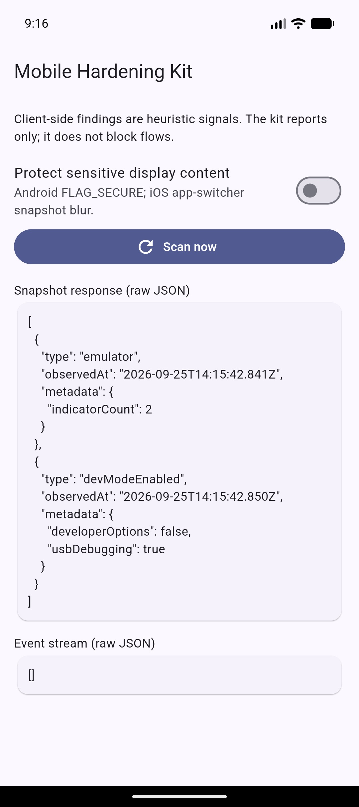
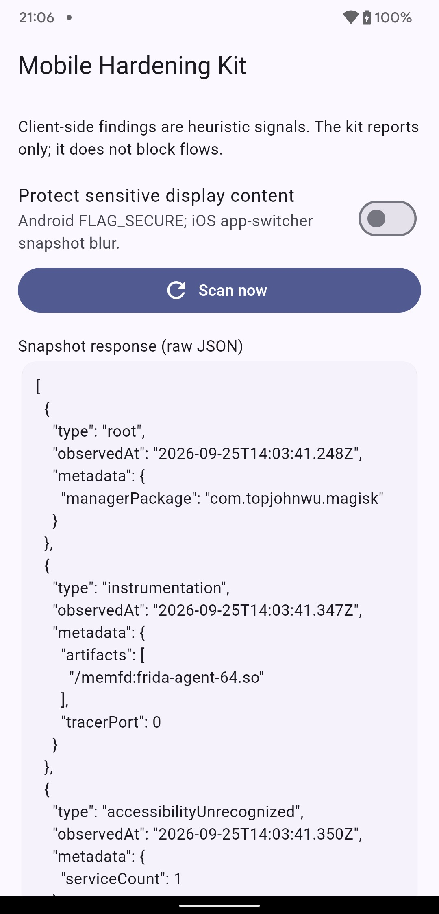
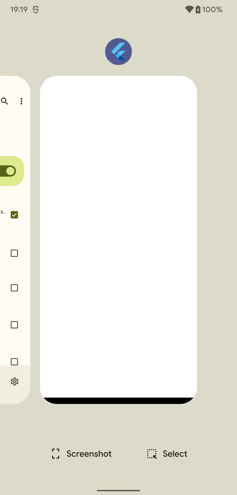
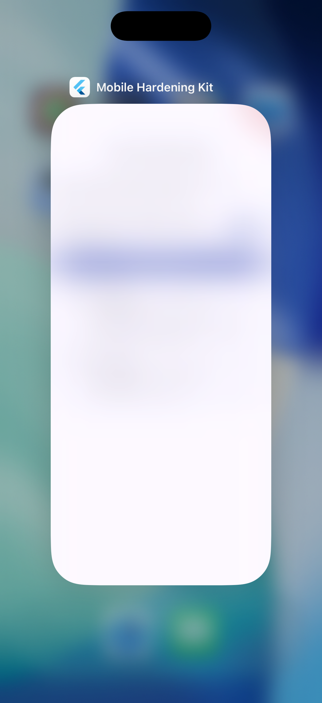

# Mobile Hardening Kit

A dependency-light library that collects heuristic client-side integrity and display signals through in-house Kotlin and Swift cores. It can be used directly from native Android and iOS apps, or through the Flutter plugin, which is a thin wrapper over the same native cores. **The kit reports signals; it never blocks a user flow or makes a product risk decision.** Client-side checks are bypassable and are not a security boundary.

## Requirements

- Flutter 3.24.0 or later
- Android min SDK 23
- iOS deployment target 13.0
- No third-party Dart runtime dependencies. The only package development dependency besides Flutter SDK test tools is the Flutter-maintained `flutter_lints` analyzer rules package.

## Add the package

```yaml
dependencies:
  mobile_hardening_kit:
    git:
      url: git@github.com:iqbal-mekari/mobile-hardening-kit.git
      ref: 0.2.0
```

## Native integration (no Flutter)

The detection logic lives in two Flutter-free cores; the Flutter plugin only adapts them to method/event channels.

| Platform | Core | Flutter adapter |
| --- | --- | --- |
| Android | `native/android/core` (`MobileHardeningKit.kt`, `HardeningSignal.kt`) | `android/.../MobileHardeningKitPlugin.kt` |
| iOS | `ios/Classes/Core` (`MobileHardeningKit.swift`, `HardeningSignal.swift`) | `ios/Classes/MobileHardeningKitPlugin.swift` |

### Android (Kotlin/Java, min SDK 23)

Each tagged release publishes the AAR to this repository's GitHub Packages (Maven) and attaches the AAR, POM, and Gradle metadata to the GitHub Release. GitHub Packages requires a token even for public packages: use a personal access token with `read:packages`, supplied as Gradle properties or environment variables (never commit it).

```gradle
repositories {
  maven {
    url = uri("https://maven.pkg.github.com/iqbal-mekari/mobile-hardening-kit")
    credentials {
      username = providers.gradleProperty("gpr.user").orNull ?: System.getenv("GITHUB_ACTOR")
      password = providers.gradleProperty("gpr.key").orNull ?: System.getenv("GITHUB_TOKEN")
    }
  }
}
dependencies { implementation "com.mekari.mobile_hardening_kit:mobile-hardening-kit:0.2.0" }
```

To build locally instead: `cd native/android && ./gradlew :core:publishReleasePublicationToMavenLocal`, then use `mavenLocal()`.

```kotlin
val kit = MobileHardeningKit(applicationContext)
val signals = kit.snapshot(
  HardeningConfig(
    expectedSigningCertificateSha256 = "0123...abcd", // optional
    trustedAccessibilityPackages = setOf("com.example.approvedaccessibility"),
  )
)

// Optional: events and opt-in FLAG_SECURE need the host activity.
kit.attachActivity(activity)          // onCreate/onStart; pair with detachActivity() in onDestroy
kit.startObserving { signal -> /* HardeningSignal */ }
kit.setScreenProtectionEnabled(true)  // sensitive flow only
// ...
kit.stopObserving()
kit.detachActivity()
```

Call all methods from the main thread. `detachActivity()` restores the window's original `FLAG_SECURE` state. The library manifest declares `DETECT_SCREEN_CAPTURE` (normal permission, needed for Android 14+ screenshot events) and the Magisk `<queries>` entry; both merge into your app.

### iOS (Swift, iOS 13+)

Swift Package Manager (root `Package.swift`, product `MobileHardeningKit`):

```swift
.package(url: "https://github.com/iqbal-mekari/mobile-hardening-kit", from: "0.2.0")
```

```swift
import MobileHardeningKit

let kit = MobileHardeningKit()
let signals = kit.snapshot()                 // [HardeningSignal]
kit.startObserving { signal in /* capture, screenshot, external display changes */ }
kit.setScreenProtectionEnabled(true)         // sensitive flow only; blurs the app-switcher snapshot
// ...
kit.stopObserving()
```

iOS has no signer-certificate config: it cannot read its signing fingerprint. To use the `jailbreak` URL-scheme check, add `cydia` and `sileo` to the host app's `LSApplicationQueriesSchemes`. Call from the main thread.

### Signal schema

Both cores emit `HardeningSignal(type, observedAt, metadata)`; `toMap()` (Kotlin) / `dictionary` (Swift) yield the map the Flutter channel and Dart decoder use. Type names are identical across Kotlin, Swift, and Dart (`HardeningSignalType`).

### Native samples

- **Android** — `example/android` (framework-only UI). It consumes the released AAR (`mhkVersion` in `gradle.properties`) from the GitHub Release assets, anonymously, using the attached Gradle module metadata: `cd example/android && ./gradlew :app:installDebug`, then launch "Hardening Kit Sample". To try unreleased source, run `./gradlew :core:publishReleasePublicationToMavenLocal -PlibraryVersion=<version>` in `native/android`, then build the sample with `-PmhkUseMavenLocal -PmhkVersion=<version>`.
- **iOS** — `example/ios/MobileHardeningKitSample.xcodeproj` (SwiftUI, iOS 14+). It consumes the tagged sources of this repository through SPM (`https://github.com/iqbal-mekari/mobile-hardening-kit`, exact version pinned in the project): open it in Xcode and run on a simulator or device, or `xcodebuild -project example/ios/MobileHardeningKitSample.xcodeproj -scheme MobileHardeningKitSample -destination 'platform=iOS Simulator,name=iPhone 17' build`. To try unreleased source, edit the package reference to a branch or a local path in Xcode (do not commit that change).
- **Flutter** — `example/flutter` (see below).

Both show a snapshot, live events, and the opt-in protection toggle. Because they consume a published version, they demonstrate exactly what an app gets from a release; after each release, bump `mhkVersion` and the iOS package requirement. On the iOS simulator the `jailbreak` finding comes from host-shared paths such as `/usr/bin/ssh`; this is an expected heuristic false positive.

## Collect signals

```dart
import 'package:mobile_hardening_kit/mobile_hardening_kit.dart';

final hardening = MobileHardeningKit(
  // Optional. SHA-256 hex fingerprint of the expected Android signing cert.
  expectedSigningCertificateSha256: '0123...abcd',
  // Android enabled accessibility services not listed here produce
  // ACCESSIBILITY_UNRECOGNIZED observations for the consuming app to handle.
  trustedAccessibilityPackages: const {'com.example.approvedaccessibility'},
);

final findings = await hardening.snapshot();
for (final finding in findings) {
  // Forward to app-owned risk handling; don't assume a clean scan is proof.
  print('${finding.type.name}: ${finding.observedAt.toIso8601String()} ${finding.metadata}');
}

final subscription = hardening.stream.listen((finding) {
  // Receives platform-observable display/capture state changes, not a poll.
});
// Cancel when the owning screen/service is disposed.
await subscription.cancel();
```

Set `expectedSigningCertificateSha256` to the signing certificate's SHA-256 digest as hexadecimal, with or without colons; an unset fingerprint disables this check. iOS does not expose the app signing-certificate fingerprint to a sandboxed process, so iOS reports an absent Mach-O code-signature load command, not a pinned certificate mismatch. Plan certificate verification and authoritative integrity decisions on the server.

`HardeningSignal.metadata` is bounded, platform-generated, and intended to contain no user identifiers. `observedAt` is UTC. Unsupported or unavailable checks are omitted rather than reported as clean.

## Capabilities and platform constraints

| Signal | Android | iOS |
| --- | --- | --- |
| Root / jailbreak | `su`, Magisk/KernelSU paths, test-key build tags | Common jailbreak files and URL schemes; scheme detection requires the app's `LSApplicationQueriesSchemes` allowlist |
| Instrumentation | Frida/Xposed/LSPosed/Substrate mappings and Frida TCP listener ports | Loaded-image names for Frida/Substrate/Substitute/ElleKit/Xposed indicators |
| Debugger | Runtime debugger attachment | `sysctl` traced-process flag |
| Signature integrity | SHA-256 of installed signing certificate compared with caller-supplied fingerprint | Detects absence of Mach-O code-signature command only; cannot expose/compare signing certificate fingerprint |
| Emulator / simulator | Multiple build-property heuristics | Simulator build environment |
| Accessibility / developer settings | Reports enabled external accessibility packages not caller-trusted, developer options, or ADB | Not exposed by the platform APIs used here |
| Capture / display | Android 14+ screenshot callback while the signal stream is listened to; secondary presentation displays (virtual displays included) | Screen recording/mirroring state, screenshot event, and external display connection events |
| Protection helper | `FLAG_SECURE` on attached Flutter window | Blurred app-switcher snapshot while app is backgrounded; does not prevent screenshots or screen recording |

Detection limitations and false positives are expected. A rooted device may hide artefacts; legitimate development builds, emulators (including their virtual presentation displays), accessibility services, screen sharing, and external displays can produce signals. Android screenshot event detection requires API 34+; screen protection via `FLAG_SECURE` works from min SDK 23. Generic Android screen-recording app detection is not available to ordinary apps and is not claimed.

## Opt-in display protection

Protection is disabled by default. Enable it only around product-selected sensitive flows, then restore it when leaving that flow:

```dart
await hardening.setScreenProtectionEnabled(true);
try {
  await showSensitiveFlow();
} finally {
  await hardening.setScreenProtectionEnabled(false);
}
```

Android applies `FLAG_SECURE` to the attached Flutter activity window (so it affects that whole window). iOS adds a blur overlay only during app-switcher snapshot capture. iOS does not provide a supported API to block user screenshots; the helper only obscures the background snapshot.

## Example

`example/` holds one sample per integration style: `example/flutter` (Flutter app), `example/android` (native Android), and `example/ios` (native iOS, SPM). The Flutter app runs a scan, displays current findings, subscribes to display/capture events, and toggles the opt-in protection helper. Run it on an Android or iOS device/simulator with `cd example/flutter && flutter run`.

## Testing signal triggers

### Prepare instrumentation test tools

These tools are optional, external test-lab utilities; they do not become package dependencies. Use only disposable, authorized test devices. Rooting, injecting modules, or loading instrumentation can crash or compromise a device.

#### Frida host tools

Install the Frida CLI in an isolated host Python environment and check its version:

```sh
python3 -m venv ~/.venvs/mobile-hardening-frida
source ~/.venvs/mobile-hardening-frida/bin/activate
python -m pip install --upgrade frida-tools
frida --version
```

Use the same Frida version for the host tools and device-side server/Gadget. See the [official Frida Android](https://frida.re/docs/android/), [iOS](https://frida.re/docs/ios/), and [release](https://github.com/frida/frida/releases) instructions.

#### Android: Frida server and Xposed-compatible frameworks

Use a disposable rooted emulator/device. Check its ABI with `adb shell getprop ro.product.cpu.abilist`; download the matching `frida-server` asset for that ABI and the same version shown by `frida --version`, extract it, and name it `frida-server`.

```sh
adb root # only on emulator images that support root adb
adb push frida-server /data/local/tmp/frida-server
adb shell "chmod 755 /data/local/tmp/frida-server"
adb shell "/data/local/tmp/frida-server >/dev/null 2>&1 &"
frida-ps -U
```

If `adb root` is unavailable on a rooted production build, start the server through `su`:

```sh
adb shell "su -c '/data/local/tmp/frida-server >/dev/null 2>&1 &'"
```

Keep it running while the example is open and tap **Scan now**; this detector checks for Frida mappings and listeners on ports 27042/27043.

`adb root` alone may not trigger the `root` signal; that detector needs a recognized root artifact or build tag, as noted in the Android trigger table below.

For Xposed/LSPosed, use a disposable image rooted with [Magisk](https://topjohnwu.github.io/Magisk/install.html) and follow the [LSPosed installation guide](https://github.com/LSPosed/LSPosed/wiki/How-to-use-it). Enable a compatible module and scope it only to the example package `com.mekari.mobile_hardening_kit_example`; force-stop and relaunch the example before scanning. The detector searches the app process mappings for `xposed`/`lsposed`, so installing the framework alone may not produce a finding if no matching mapping is exposed. Xposed-compatible frameworks apply to Android, not iOS.

#### iOS: Frida

On a jailbroken test device, install Frida using its [official iOS instructions](https://frida.re/docs/ios/) and confirm the host can see the device with `frida-ps -U`. On a non-jailbroken device, use a development-signed debuggable build; Frida's official workflow injects Gadget into debuggable apps and Xcode mounts the Developer Disk Image. Use `frida-ps -U` to find the sample process, then attach with `frida -U -n Runner`. Keep Gadget's loaded image name recognizable (for example, `FridaGadget`) because this detector checks loaded library names. Tap **Scan now**, then detach when finished. There is no Xposed setup for iOS.

Stop Frida and disable/uninstall test modules after testing. Root/jailbreak and instrumentation findings remain heuristic: a tool may be installed yet not expose a name or path this kit recognizes.

### Launch the example

From the repository root, start the example on a device or simulator:

```sh
cd example/flutter
flutter pub get
flutter devices
flutter run -d DEVICE_ID
```

The example takes a snapshot on launch and subscribes to the event stream. After changing a device setting, tap **Scan now** to refresh snapshot findings. Screenshot and display changes arrive through the stream; keep the app open and leave the protection switch off while testing screenshot events. A signal may be absent when a platform or device cannot expose that check.

### Android

Use an API 34+ emulator or device for screenshot-event testing.

On the Android 17/API 37 emulator, **Scan now** reported `emulator` (`indicatorCount: 2`) and `devModeEnabled` (`usbDebugging: true`).



On the rooted POCO F1 (Android 12/API 32), **Scan now** reported `root` with `managerPackage: "com.topjohnwu.magisk"` and, while Frida 17.18.0 was attached, `instrumentation` with `/memfd:frida-agent-64.so`. The screenshot below shows those findings alongside `accessibilityUnrecognized` and `devModeEnabled`.



LSPosed was active on the device, but its manager had no modules enabled or scoped for this app; this run did not produce an Xposed/LSPosed injection finding.

On Android 12, SELinux denied the sample's `/proc/net/tcp` read, so `tracerPort` remained `0`; the Frida mapping was detected independently.

### Capabilities

| Signal | Trigger |
| --- | --- |
| `emulator` | Run on an Android emulator and tap **Scan now**. Emulator heuristics vary by system image. |
| `devModeEnabled` | Enable **Developer options** or **USB debugging** in Android Settings, return to the app, and scan. |
| `debuggerAttach` | Attach an Android Studio **native** debugger to the running app process, then scan. The Dart/Flutter debugger alone may not attach a Java debugger. |
| `accessibilityUnrecognized` | Enable an accessibility service such as TalkBack, then scan. The example supplies no trusted-package allowlist, so enabled external services are included in the signal metadata. Turn the service off afterward. |
| `screenshotTaken` | On Android 14/API 34 or later, take a device screenshot while the example is foregrounded. The signal is delivered by the event stream, not by a later snapshot. |
| `externalDisplay` | Connect or cast to a secondary display that Android exposes as a presentation display. Emulator virtual presentation displays can also produce this finding. |
| `signatureMismatch` | For a local-only test, pass a deliberately incorrect 64-character SHA-256 value to `MobileHardeningKit(expectedSigningCertificateSha256: ...)` in `example/flutter/lib/main.dart`, rebuild, and scan. Remove the test value afterward; do not commit it. |
| `root`, `instrumentation` | These require a test environment with a recognized root artifact/build tag or instrumentation library/listener. There is no reliable standard-emulator toggle; use only an isolated, authorized test device. |

To trigger `signatureMismatch`, temporarily replace the example's `_kit` initializer with this deliberately incorrect test fingerprint, then rebuild and scan:

```dart
final MobileHardeningKit _kit = MobileHardeningKit(
  expectedSigningCertificateSha256:
      '0000000000000000000000000000000000000000000000000000000000000000',
);
```

Make sure the test value differs from the app's actual signing-certificate fingerprint; a matching value will not trigger the finding.

Restore `MobileHardeningKit()` after the test; do not commit the test fingerprint.

Android does not expose a general screen-recording-active signal to ordinary apps. The Android screenshot callback only reports user screenshot events on API 34+ while the example's stream is subscribed.

### iOS

Run the example in the iOS Simulator or on a test device. The simulator reports `emulator` (the signal type is shared across platforms).

### Capabilities

| Signal | Trigger |
| --- | --- |
| `debuggerAttach` | Run the app from Xcode using the Debug configuration, or attach Xcode's debugger to the running app, then tap **Scan now**. |
| `screenshotTaken` | On a physical iPhone/iPad, take a screenshot with the hardware buttons while the example is foregrounded. The notification arrives through the event stream. |
| `screenCaptureActive` | Start screen recording or screen mirroring from Control Center; stop it to observe the state change. |
| `externalDisplay` | Connect an external display or start AirPlay mirroring, then observe the stream (or scan while it is connected). |
| `jailbreak`, `instrumentation` | These need a jailbroken or instrumented test environment exposing one of the implementation's recognized artifacts. They have no standard Simulator trigger. |

The iOS `signatureMismatch` check only reports a missing Mach-O code-signature command; it cannot compare signing certificates. A normally signed iOS app cannot safely be made unsigned just to trigger this finding. iOS does not expose Android's accessibility/developer-setting checks.

### Test the separate screen-protection helper

The **Protect sensitive display content** switch is independent of signal detection. On Android it enables `FLAG_SECURE` for the app window, preventing screenshots while enabled. On iOS it blurs the app-switcher snapshot; it does not block screenshots or recording. Turn protection off before testing screenshot signals.

With protection enabled and the app switcher open, the POCO F1 (Android 12/API 32) showed a blank app preview, while the iPhone 17 Pro Simulator (iOS 26.4) showed an obscured snapshot:

| POCO F1 | iPhone 17 Pro Simulator |
| --- | --- |
|  |  |

## Development

```sh
flutter pub get
flutter analyze
flutter test
cd example/flutter && flutter pub get && flutter build apk --debug
```

GitHub Actions analyzes and tests the package and example and builds the Android example for pull requests. Pushing a `v*` tag runs the same checks, builds a release APK, uploads it as a workflow artifact and GitHub Release asset, and uses `CHANGELOG.md` as the release notes. Update the changelog before every release tag.
